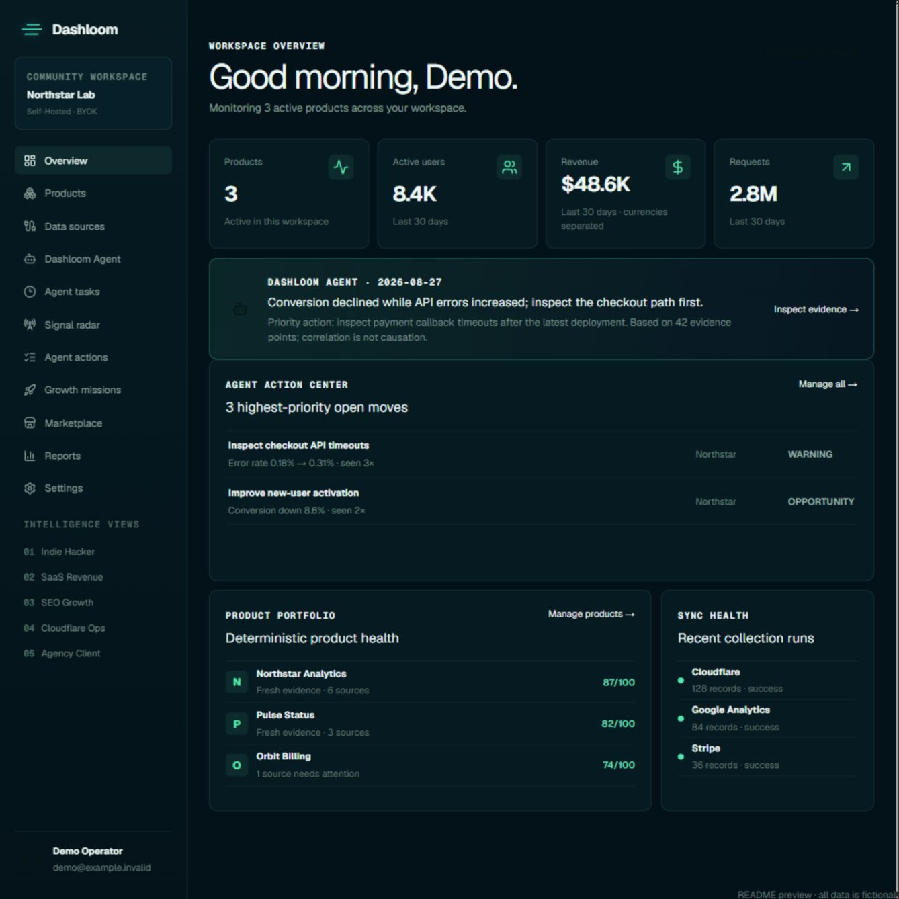
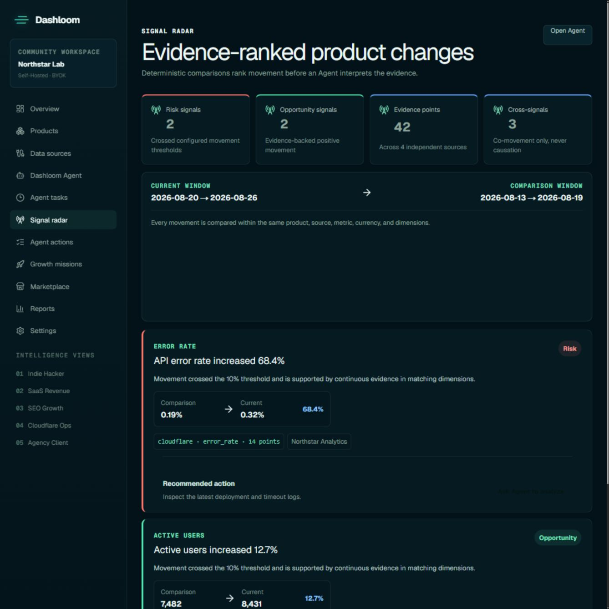
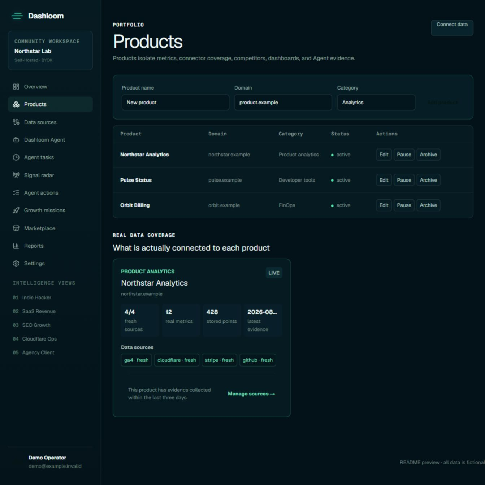

# Dashloom Community

[简体中文](README.zh-CN.md) · English

Self-hosted AI product intelligence for teams that want one evidence layer across product analytics, revenue, acquisition, search, and business operations.

Dashloom Community normalizes operational signals, calculates deterministic metrics, and lets specialized Agents analyze the resulting evidence with your own OpenAI-compatible model. Your application, D1 or Supabase PostgreSQL database, provider credentials, schedules, and reports run in infrastructure you control.



> All screenshots use fictional products, identities, domains, and metrics. They are rendered with the real Community UI components and styles.

## What is included

- Product-scoped evidence, goals, competitors, dashboards, actions, and Growth Missions.
- Five intelligence views: Indie Hacker, SaaS Revenue, SEO Growth, Cloudflare Operations, and Agency Client.
- BYOK Agent conversations, Executive Briefs, model comparison, task history, and evidence citations.
- Signal Radar for deterministic period comparisons and cross-signal hypotheses without causal overclaiming.
- Google Analytics/Search Console, Bing Webmaster, Cloudflare D1 business aggregates, Stripe, Lemon Squeezy, Creem, Polar, Paddle, and Custom REST connectors.
- Manual imports, open ingestion API keys, calculated metrics, scheduled synchronization, and locally stored reports.
- English and Simplified Chinese dashboard navigation, workspace-level locale preferences, and focused tabbed workflows.
- Connector and Agent Skill SDKs, reviewed community extensions, audit history, and portable evidence export.

Dashloom Community is a standalone open-source product. It has no source, package, runtime, database, deployment, Git, or build dependency on the private Dashloom Cloud repository.

## Deployment methods and data sources are separate concerns

Dashloom Community runs on infrastructure you control. Choose a deployment target and application database first; after signing in, connect only the business sources whose evidence you need. Deploying on a platform does not automatically make that platform a Dashloom data source.

### Deployment paths

| Path | Application runtime | Application database |
| --- | --- | --- |
| Cloudflare-native | Vinext on Cloudflare Workers | Native Cloudflare D1 binding |
| Vercel | Next.js on Node.js | Cloudflare Remote D1 or Supabase PostgreSQL |
| AWS | Next.js on Node.js, including AWS Amplify Hosting | Cloudflare Remote D1 or Supabase PostgreSQL |

### Open-source technology stack

<p align="center">
  
  
  
  
  
  
  
  
  
  
  
</p>

| Area | Technologies | Role in Dashloom |
| --- | --- | --- |
| Deployment | Cloudflare Workers, Vercel, AWS | Hosts the Community application |
| Storage | Cloudflare D1, Supabase PostgreSQL | Stores authentication, workspace configuration, normalized evidence, Agent state, reports, schedules, and audit history |
| Application | Next.js, React, Node.js | Provides the server runtime and product interface |
| Development | TypeScript, Tailwind CSS | Provides typed application code and the UI styling system |
| Optional Cloudflare analytics | Cloudflare R2 | Supplies bounded operational metrics through the retained compatibility connector; it is not an application storage backend |

The Dashboard business-source catalog covers Google Analytics, Google Search Console, Bing Webmaster Tools, Cloudflare D1 business data, Stripe, Lemon Squeezy, Creem, Polar, Paddle, and custom ingestion. Deployment platforms and application databases remain separate from this catalog.

See the [Vercel and AWS deployment guide](docs/deployment-next.md) and [Cloudflare deployment guide](docs/cloudflare-setup.md) for setup details.

## Product tour

### Evidence-ranked Signal Radar

Dashloom compares matching products, sources, metrics, currencies, and dimensions before promoting a change. Agent interpretation happens after deterministic ranking and keeps correlation separate from causation.



### Products as data-isolation boundaries

Each product owns its connector mappings, normalized metrics, goals, competitors, Agent evidence, actions, missions, and schedules. Coverage cards show what is actually connected and how fresh the evidence is.



### Bilingual, task-focused workspace

Choose English or Simplified Chinese from the dashboard account menu or **Settings → Workspace**. The preference is stored on the workspace and applies to navigation and core product pages. Products, data sources, Agent analysis, and settings use tabs to keep long operational workflows focused without changing their authorization or data boundaries.

## Architecture

```text
Product UI
    │
    ▼
Authenticated server routes ──► workspace and product authorization
    │
    ├──► provider adapters ──► normalized evidence in D1 or Supabase PostgreSQL
    ├──► deterministic metrics, goals, health, and Signal Radar
    └──► BYOK Agent orchestration ──► cited findings and actions
```

- Better Auth owns users, sessions, accounts, verification, and password recovery.
- Workspaces own products, connectors, normalized metrics, reports, schedules, ingestion keys, and audit events.
- Provider and model credentials are encrypted server-side and never included in portable exports.
- The browser never grants workspace access, decrypts credentials, or supplies trusted evidence.

See [the architecture guide](docs/architecture.md) for the complete boundary and data-ownership model.

## Requirements

- Node.js 22.13 or newer
- npm 10 or newer
- A Cloudflare account for Workers/D1 deployment, or a Node.js host plus Supabase for the PostgreSQL path

> **Database boundary:** Community uses a standalone Community-only schema. Use a fresh D1 database or Supabase project; do not point this repository at an existing Dashloom Cloud or pre-release Dashloom database.
- Wrangler 4.x, installed through this repository's development dependencies
- An OpenAI-compatible provider key if you want to run Agents

## Local installation

### 1. Clone and install

```bash
git clone https://github.com/dashloom-dev/dashloom.git
cd dashloom
npm install
```

For reproducible CI installs, use `npm ci` instead of `npm install`.

### 2. Create the local environment file

macOS or Linux:

```bash
cp .dev.vars.example .dev.vars
```

Windows PowerShell:

```powershell
Copy-Item .dev.vars.example .dev.vars
```

Generate two independent random values and place them in `.dev.vars` as `BETTER_AUTH_SECRET` and `CREDENTIALS_ENCRYPTION_KEY`:

```bash
node -e "console.log(require('crypto').randomBytes(32).toString('hex'))"
```

Run the command twice. Never reuse these secrets, commit `.dev.vars`, or put provider keys in `NEXT_PUBLIC_*` variables.

Minimum local configuration:

```dotenv
BETTER_AUTH_SECRET=replace-with-a-random-value-at-least-32-characters
BETTER_AUTH_URL=http://localhost:3000
CREDENTIALS_ENCRYPTION_KEY=replace-with-a-different-random-value
AUTH_REQUIRE_EMAIL_VERIFICATION=false
```

Google OAuth, transactional email, and report cron variables are optional for the first local run. Their complete names are documented in [.dev.vars.example](.dev.vars.example).

### 3. Initialize the local D1 database

```bash
npm run db:migrate:local
npm run db:status:local
```

Wrangler stores the local database under the ignored `.wrangler/` directory. These commands do not touch a remote D1 database.

### 4. Start Dashloom

```bash
npm run dev
```

Open [http://localhost:3000](http://localhost:3000), create the first local account, and Dashloom will create its isolated Community workspace.

## First-use tutorial

### Step 1: Add a product

Open **Products**, then add the product name, public domain, and category. A product is the isolation boundary used by connector mappings, evidence, dashboards, Agent conversations, goals, and recurring jobs.

### Step 2: connect or import evidence

Open **Data sources** and choose one path:

- connect Google Analytics/Search Console, Bing Webmaster, or a supported revenue provider with a least-privilege credential;
- configure a read-only aggregate D1 query;
- import normalized metric rows manually;
- create a scoped ingestion key for the TypeScript SDK or Connector Worker;
- connect a Custom REST endpoint that returns the validated aggregate metric contract.

After synchronization, check the product coverage card for source freshness, stored point count, and Agent readiness. Dashloom does not add demo evidence to a real workspace.

### Step 3: connect your model

Open **Settings**, add an OpenAI-compatible BYOK provider, and select the model to use. The credential is encrypted with `CREDENTIALS_ENCRYPTION_KEY` before it is stored in the selected application database.

Community Agent execution is BYOK-only. No managed model allowance or Dashloom subscription is required.

### Step 4: ask an evidence-backed question

Open **Dashloom Agent**, select a specialist and product scope, then ask a question such as:

```text
Which material changes should we investigate this week, and which evidence supports each recommendation?
```

An Agent run freezes the evidence bundle used for the answer. Findings must cite evidence from that bundle and disclose truncation or missing coverage.

### Step 5: operate the recurring loop

- Use **Signal radar** to review deterministic risks and opportunities.
- Promote useful findings into **Agent actions** and measure outcomes.
- Turn repeatable improvement work into **Growth missions**.
- Create local report and synchronization schedules.
- Keep the Worker cron enabled on Cloudflare, or invoke the authenticated maintenance and report endpoints from the scheduler on your Node.js hosting platform.

## Environment reference

| Variable | Required | Purpose |
| --- | --- | --- |
| `BETTER_AUTH_SECRET` | Yes | Signs authentication state; minimum 32 characters. |
| `BETTER_AUTH_URL` | Yes | Canonical application origin used by Better Auth. |
| `CREDENTIALS_ENCRYPTION_KEY` | Yes | Encrypts connector and BYOK credentials server-side. |
| `REPORT_CRON_SECRET` | Recommended | Protects manual cron endpoints. Use a separate random value. |
| `GOOGLE_OAUTH_CLIENT_ID` | For Google | Google Web Application OAuth client ID. |
| `GOOGLE_OAUTH_CLIENT_SECRET` | For Google | Google OAuth client secret. |
| `AUTH_EMAIL_WEBHOOK_URL` | For email delivery | HTTPS endpoint for verification and password-reset mail. |
| `AUTH_EMAIL_WEBHOOK_SECRET` | For email delivery | Authentication secret sent to the email relay. |
| `AUTH_REQUIRE_EMAIL_VERIFICATION` | Optional | Set to `true` when production email delivery is configured. |
| `DASHLOOM_DEFAULT_LOCALE` | Optional | Deployment default for authentication, recovery emails, and new workspaces. Use `en` (default) or `zh-CN`; users can still change their workspace language later. |
| `NEXT_PUBLIC_APP_URL` | Optional | Public, non-secret origin override; belongs in `.env`. |
| `DASHLOOM_DATABASE` | Node deployment | Selects `d1` or `supabase` at build and runtime. |
| `CLOUDFLARE_ACCOUNT_ID` | Node + D1 | Cloudflare account that owns the application D1 database. |
| `CLOUDFLARE_D1_DATABASE_ID` | Node + D1 | UUID of the intended application D1 database. |
| `CLOUDFLARE_D1_API_TOKEN` | Node + D1 | Dedicated server-only token used by the parameterized Remote D1 adapter. |
| `SUPABASE_DATABASE_URL` | Supabase storage | Server-only PostgreSQL connection or transaction-pooler URL. |
| `SUPABASE_DATABASE_POOL_SIZE` | Optional | Per-instance PostgreSQL connection cap from 1–20; defaults to 5. |
| `SUPABASE_DATABASE_SSL` | Optional | Keep TLS required; use `disable` only for a trusted local or self-hosted PostgreSQL environment. |

Connector and model keys are entered through authenticated product forms. Do not put them in public environment variables or commit them to the repository.

## Production deployment on Cloudflare

1. Create a D1 database and replace the placeholder database name and ID in `wrangler.jsonc`. Set `DASHLOOM_DEFAULT_LOCALE` under `vars` to `en` or `zh-CN`.
2. Configure production secrets with `npx wrangler secret put <NAME>`; never copy local secrets into source control.
3. Apply migrations to the intended remote database:

   ```bash
   npx wrangler d1 migrations apply <your-database-name> --remote
   npx wrangler d1 migrations list <your-database-name> --remote
   ```

4. Confirm there are no pending migrations and verify the affected tables in that exact database.
5. Validate and deploy:

   ```bash
   npm run build
   npx wrangler deploy --dry-run
   npx wrangler deploy
   ```

6. Test authentication, product isolation, connectors, BYOK analysis, schedules, export, and recovery against the deployed origin.

A migration file existing in the repository is not proof that production was migrated. Remote production schema work is complete only after the intended D1 database has been applied and verified.

## Production deployment on Vercel or AWS

The Node.js runtime supports two complete storage paths: Remote D1 through Cloudflare's authenticated HTTP API, or Supabase PostgreSQL through the pooled PostgreSQL adapter. The Supabase path stores authentication, workspace configuration, normalized evidence, Agent state, reports, schedules, and audit history in the same 38-table application model.

Set `DASHLOOM_DEFAULT_LOCALE=en` or `DASHLOOM_DEFAULT_LOCALE=zh-CN` in the Vercel or AWS environment before building. It controls the initial authentication language, authentication email language, and locale assigned to newly created workspaces. Existing workspace preferences remain unchanged.

See the [Vercel and AWS deployment guide](docs/deployment-next.md) for backend selection, build commands, scheduler integration, pooler settings, migrations, and verification. A successful build does not prove that a remote database was migrated.

## Validation

```bash
npm run typecheck
npm run typecheck:supabase
npm run lint
npm test
npm run build
npm run build:supabase
npm run validate:extensions
npm run validate:connector-worker
npm run eval:agent
```

## Troubleshooting

- **`DB` binding is unavailable:** confirm the D1 binding in `wrangler.jsonc` is named `DB`, then restart the development server.
- **Authentication configuration error:** ensure `BETTER_AUTH_SECRET` is at least 32 characters and `BETTER_AUTH_URL` matches the current origin.
- **Provider credentials cannot be saved:** configure a separate `CREDENTIALS_ENCRYPTION_KEY` of at least 32 characters.
- **Agent is not ready:** connect a BYOK model and verify that the selected product has recent metrics matching that specialist.
- **Signal Radar is empty:** collect two comparable periods of evidence; Dashloom will not invent signals when the threshold is not crossed.
- **Remote D1 is unavailable on Node.js:** verify the account ID, database UUID, and dedicated API token belong to the same intended database.
- **Supabase cannot connect:** keep the connection URL server-only, prefer the transaction pooler on serverless platforms, and verify the per-instance pool cap.
- **Scheduled work does not run:** confirm the Worker cron is deployed, or configure the Node.js platform scheduler to call the authenticated maintenance and report endpoints.

## Documentation

- [Architecture and security boundaries](docs/architecture.md)
- [Vercel and AWS deployment](docs/deployment-next.md)
- [Backup and recovery](docs/backup-and-recovery.md)
- [First-value path](docs/first-value-path.md)
- [Connector account lifecycle](docs/connector-account-lifecycle.md)
- [Bing Webmaster setup](docs/bing-webmaster-setup.md)
- [Automatic synchronization](docs/automatic-sync-and-retention.md)
- [Automated reports](docs/automated-reports.md)
- [Agent Executive Briefs](docs/agent-executive-briefs.md)
- [Agent task center](docs/agent-task-center.md)
- [Teams and portable data](docs/teams-and-data-control.md)
- Connector-specific guides are available under [`docs/`](docs/).

## Security

Use least-privilege provider credentials, rotate leaked secrets immediately, keep OAuth callbacks on the configured origin, and review generated Agent findings against their cited evidence before acting on them. Do not include credentials, personal data, or unbounded raw event payloads in imported metrics.

## License

[MIT](LICENSE)
