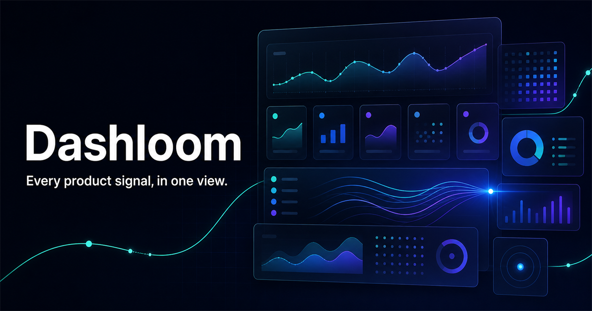

<p align="center">
  
</p>

<h1 align="center">Dashloom</h1>

<p align="center">让所有产品数据，变成下一步行动。</p>

<p align="center"><a href="README.md">English</a> · <a href="https://dashloom.dev/zh">网站</a> · <a href="https://dashloom.dev/docs">文档</a></p>

Dashloom 是一个开源、Cloudflare 原生的 AI 产品智能平台，面向经营一个或多个产品的独立开发者和小型团队。它连接运营、获客、SEO、收入和竞品数据，再由专用 Agent 解释变化、寻找机会、基于证据回答问题并生成定期报告。



## 当前里程碑

仓库当前包含：

- 英文产品首页和中文本地化入口
- 使用虚构数据的多产品控制台预览
- 兼容 Cloudflare 的 Vinext 运行时
- 面向多租户的 D1 与 Drizzle 数据模型
- BYOK/托管 AI Provider、Agent、使用事件、报告和推送渠道的数据基础
- Indie Hacker、SaaS 收入、SEO 增长、Cloudflare 运维和 Agency 客户五套看板定义
- canonical、多语言 sitemap、robots 和社交分享信息

Cloudflare/Google 授权、定时同步和公开账号注册属于下一个开发阶段。AI 分析也必须通过同样的生产门槛：最小化证据包、凭证加密、额度校验、可重试工作流和评测完成后，才会被描述为可用能力。

## AI 模型选择

- **社区版：** 在自己的部署中配置 OpenAI 兼容 API 地址、API Key 和模型。
- **Dashloom Cloud：** 计划提供按套餐管理的 AI 额度、自动分析、报告推送，并保留可选 BYOK。

API Key 仅在服务端使用，持久化前必须加密。LLM 负责解释服务端计算好的指标，不作为收入、排名或运维数据的事实来源。

进一步阅读：[产品策略](docs/product-strategy.md)与[公开路线图](docs/roadmap.md)。

## 本地开发

需要 Node.js 22.13 或更新版本以及 npm。

```bash
npm install
npm run dev
```

打开开发服务器输出的本地地址即可。

## 验证

```bash
npm run typecheck
npm run lint
npm run build
npm run db:generate
```

## 架构边界

- 产品界面只调用稳定的服务端接口，不掌管授权或凭证真值。
- 产品、连接器、指标和同步任务都必须属于明确的工作空间。
- 凭证只保存在服务端，进入持久化之前必须加密。
- 第三方 Provider ID 不作为产品核心身份。
- 外部连接器启用前，同步写入必须具备幂等性。

## 许可证

[MIT](LICENSE)
