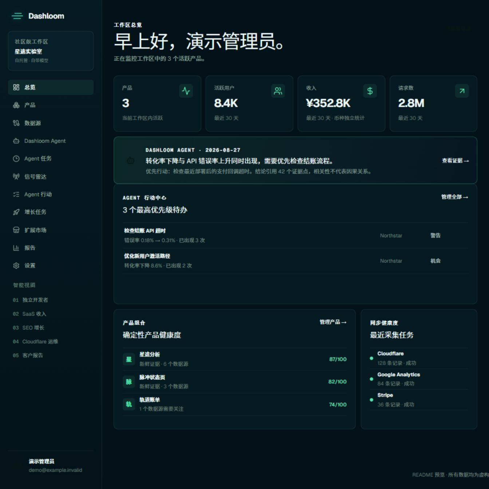
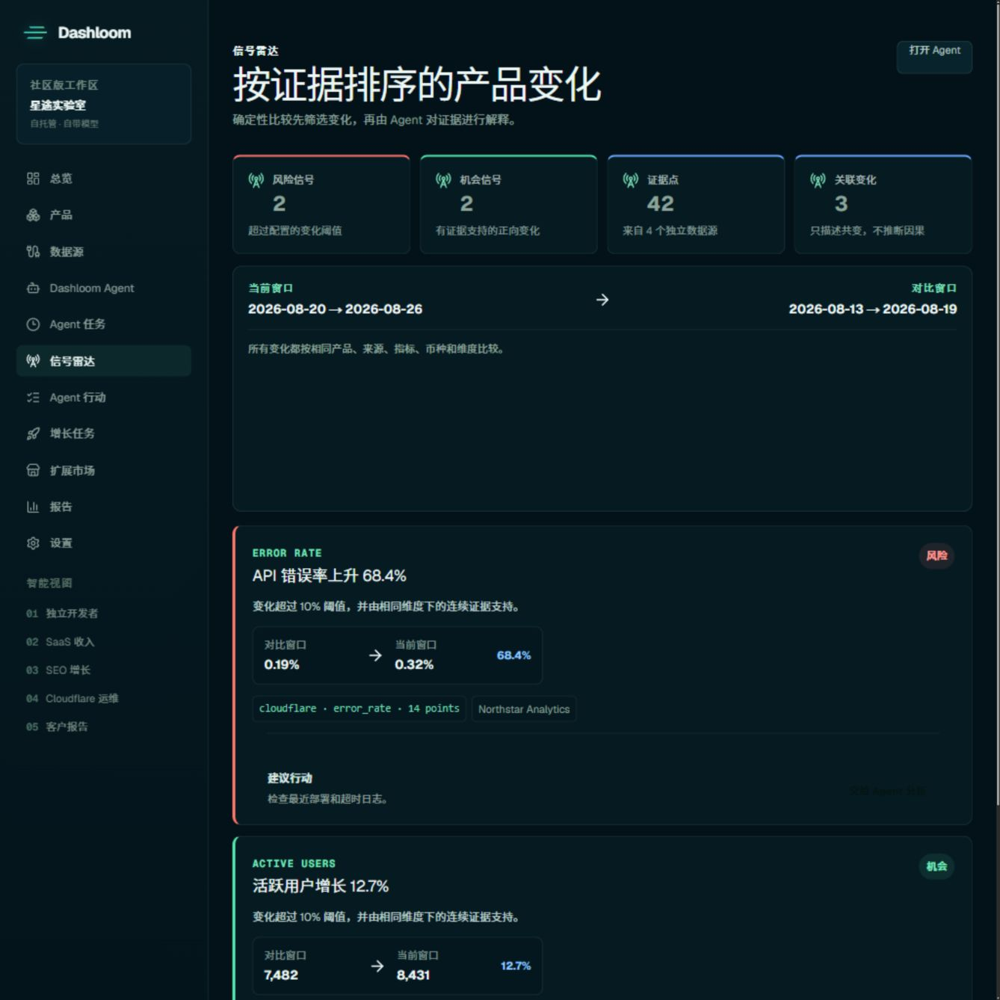
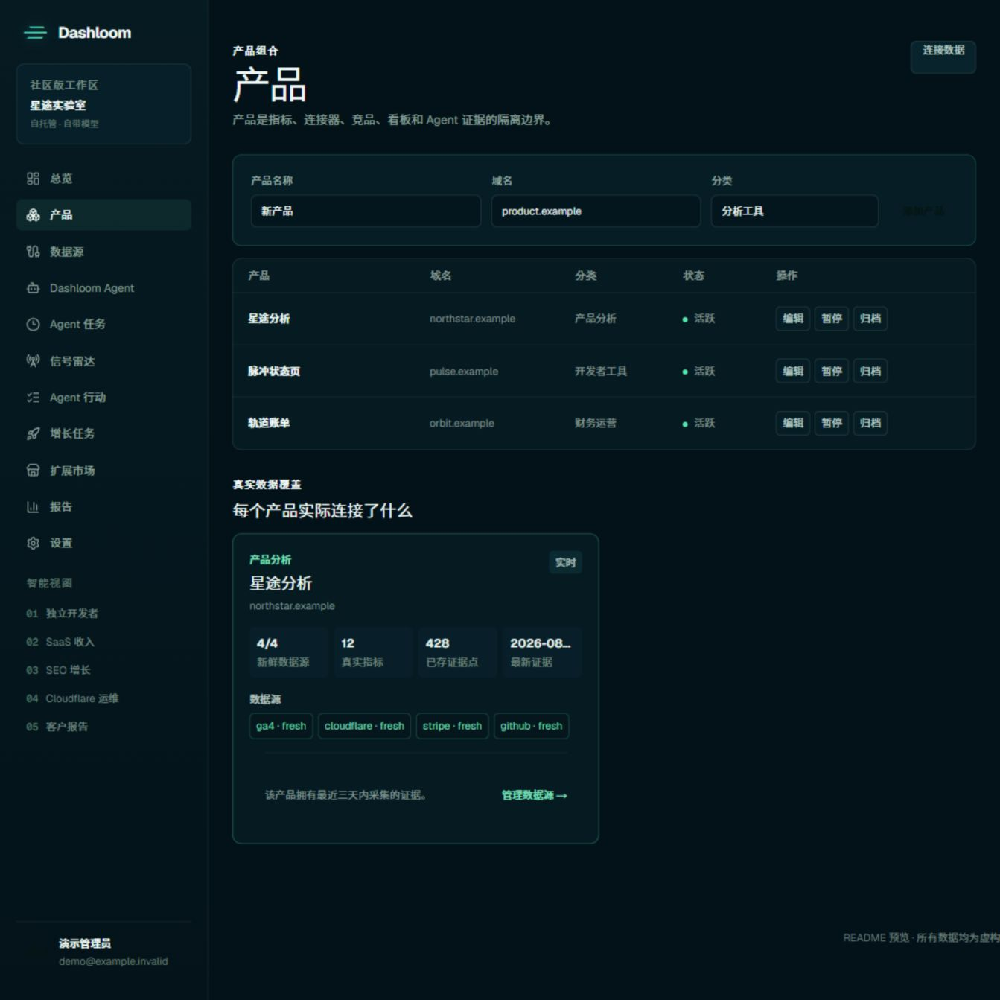

# Dashloom Community

简体中文 · [English](README.md)

Dashloom Community 是一套自托管的 AI 产品情报系统，帮助团队把产品分析、收入、获客、搜索和业务运营信号汇总到同一层可验证证据中。

Dashloom 会标准化运营数据、计算确定性指标，再让专用 Agent 使用你自己的 OpenAI 兼容模型分析这些证据。应用、D1 或 Supabase PostgreSQL 数据库、Provider 凭证、定时任务和报告都运行在你控制的基础设施中。



> 所有截图都使用虚构的产品、身份、域名和指标，并由 Community 版本的真实 UI 组件和样式渲染。

## 包含哪些能力

- 以产品为范围隔离证据、目标、竞品、看板、行动和 Growth Mission。
- 独立开发者、SaaS 收入、SEO 增长、Cloudflare 运维和客户报告五类智能视图。
- BYOK Agent 对话、Executive Brief、模型对比、任务历史和证据引用。
- 使用确定性周期比较发现变化的信号雷达；关联信号不会被表述为因果关系。
- Google Analytics/Search Console、Bing Webmaster、Cloudflare D1 业务聚合、Stripe、Lemon Squeezy、Creem、Polar、Paddle 和 Custom REST 连接器。
- 手动导入、开放摄取 API Key、计算指标、定时同步和本地报告。
- 中英文控制台导航、工作空间级语言偏好，以及按任务分组的标签页工作流。
- Connector/Agent Skill SDK、社区扩展审核、审计历史和可迁移证据导出。

Dashloom Community 是独立的开源产品，与私有 Dashloom Cloud 仓库不存在源码、Package、运行时、数据库、部署、Git 或构建依赖。

## 部署方式与数据源是两类概念

Dashloom Community 运行在你控制的基础设施中。先选择部署目标和应用数据库，登录后再按实际需要连接业务数据源。部署到某个平台，并不会自动把该平台变成 Dashloom 数据源。

### 部署路径

| 路径 | 应用运行时 | 应用数据库 |
| --- | --- | --- |
| Cloudflare 原生 | Vinext 运行于 Cloudflare Workers | 原生 Cloudflare D1 Binding |
| Vercel | Next.js 运行于 Node.js | Cloudflare Remote D1 或 Supabase PostgreSQL |
| AWS | Next.js 运行于 Node.js，包括 AWS Amplify Hosting | Cloudflare Remote D1 或 Supabase PostgreSQL |

### 开源技术栈

<p align="center">
  
  
  
  
  
  
  
  
  
  
  
</p>

| 分类 | 技术 | 在 Dashloom 中的作用 |
| --- | --- | --- |
| 部署 | Cloudflare Workers、Vercel、AWS | 承载 Community 应用 |
| 存储 | Cloudflare D1、Supabase PostgreSQL | 保存认证、工作空间配置、标准化证据、Agent 状态、报告、计划和审计历史 |
| 应用 | Next.js、React、Node.js | 提供服务端运行时和产品界面 |
| 开发 | TypeScript、Tailwind CSS | 提供类型安全的应用代码和界面样式系统 |
| 可选 Cloudflare 分析 | Cloudflare R2 | 通过保留的兼容连接器提供有界运维指标，不作为应用存储后端 |

控制台业务数据源目录包括 Google Analytics、Google Search Console、Bing Webmaster Tools、Cloudflare D1 业务数据、Stripe、Lemon Squeezy、Creem、Polar、Paddle 和自定义数据接入。部署平台和应用数据库与此目录保持分离。

配置方式见 [Vercel 和 AWS 部署指南](docs/deployment-next.zh-CN.md)及 [Cloudflare 部署指南](docs/cloudflare-setup.zh-CN.md)。

## 产品功能

### 以证据排序的信号雷达

Dashloom 先在相同产品、来源、指标、币种和维度内进行确定性比较，再把变化交给 Agent 解释。相关性和因果关系会被明确区分。



### 产品是数据隔离边界

每个产品拥有自己的连接器映射、标准化指标、目标、竞品、Agent 证据、行动、任务和定时计划。数据覆盖卡片会显示实际连接内容及证据新鲜度。



### 双语、聚焦任务的工作空间

可以从控制台账号菜单或**设置 → 工作空间**选择 English 或简体中文。语言偏好保存在工作空间中，并应用到导航和核心产品页面。产品、数据源、Agent 分析与设置使用标签页组织长流程，但不会改变授权或数据边界。

## 架构

```text
产品界面
   │
   ▼
认证服务端路由 ──► 工作区与产品权限校验
   │
   ├──► Provider 适配器 ──► D1 或 Supabase PostgreSQL 标准化证据
   ├──► 确定性指标、目标、健康度和信号雷达
   └──► BYOK Agent 编排 ──► 带证据引用的发现与行动
```

- Better Auth 管理用户、Session、账号、验证和密码恢复。
- 工作区拥有产品、连接器、标准化指标、报告、计划、摄取 Key 和审计事件。
- Provider 和模型凭证在服务端加密，且不会进入可迁移导出。
- 浏览器不会授予工作区访问权限、解密凭证或提供可信证据。

完整边界和数据所有权说明见[架构文档](docs/architecture.zh-CN.md)。

## 环境要求

- Node.js 22.13 或更高版本
- npm 10 或更高版本
- Workers/D1 部署需要 Cloudflare 账号；PostgreSQL 路径需要 Node.js 托管平台和 Supabase

> **数据库边界：** Community 使用独立的 Community 专属 Schema。请创建新的 D1 数据库或 Supabase 项目，不要让本仓库连接已有的 Dashloom Cloud 或预发布 Dashloom 数据库。
- Wrangler 4.x，已包含在本仓库开发依赖中
- 运行 Agent 时需要 OpenAI 兼容 Provider Key

## 本地安装

### 1. 克隆并安装依赖

```bash
git clone https://github.com/dashloom-dev/dashloom.git
cd dashloom
npm install
```

CI 环境建议使用 `npm ci` 获得可复现安装。

### 2. 创建本地环境文件

macOS 或 Linux：

```bash
cp .dev.vars.example .dev.vars
```

Windows PowerShell：

```powershell
Copy-Item .dev.vars.example .dev.vars
```

生成两个相互独立的随机值，分别写入 `.dev.vars` 的 `BETTER_AUTH_SECRET` 与 `CREDENTIALS_ENCRYPTION_KEY`：

```bash
node -e "console.log(require('crypto').randomBytes(32).toString('hex'))"
```

请执行两次。不要复用两个 Secret，不要提交 `.dev.vars`，也不要把 Provider Key 写入 `NEXT_PUBLIC_*` 变量。

最低本地配置：

```dotenv
BETTER_AUTH_SECRET=replace-with-a-random-value-at-least-32-characters
BETTER_AUTH_URL=http://localhost:3000
CREDENTIALS_ENCRYPTION_KEY=replace-with-a-different-random-value
AUTH_REQUIRE_EMAIL_VERIFICATION=false
```

首次本地运行不要求配置 Google OAuth、事务邮件和报告 Cron。完整变量名见 [.dev.vars.example](.dev.vars.example)。

### 3. 初始化本地 D1

```bash
npm run db:migrate:local
npm run db:status:local
```

Wrangler 会把本地数据库保存在已忽略的 `.wrangler/` 目录中。这两个命令不会访问远程 D1。

### 4. 启动 Dashloom

```bash
npm run dev
```

打开 [http://localhost:3000](http://localhost:3000)，创建第一个本地账号，Dashloom 会为它创建隔离的 Community 工作区。

## 首次使用教程

### 第一步：添加产品

进入**产品**，填写产品名称、公开域名和分类。产品是连接器映射、证据、看板、Agent 对话、目标和周期任务的隔离边界。

### 第二步：连接或导入证据

进入**数据源**，选择一种方式：

- 使用最小权限凭证连接 Google Analytics/Search Console、Bing Webmaster 或受支持的收入 Provider；
- 配置只读的 D1 聚合查询；
- 手动导入标准化指标；
- 为 TypeScript SDK 或 Connector Worker 创建限定范围的摄取 Key；
- 连接符合聚合指标校验协议的 Custom REST 接口。

同步后，在产品覆盖卡片中检查数据源新鲜度、已存证据点数量和 Agent 就绪状态。Dashloom 不会向真实工作区混入演示数据。

### 第三步：连接模型

进入**设置**，添加 OpenAI 兼容的 BYOK Provider 并选择模型。模型凭证写入所选应用数据库前会使用 `CREDENTIALS_ENCRYPTION_KEY` 加密。

Community 的 Agent 只使用 BYOK，不需要 Dashloom 托管模型额度或订阅。

### 第四步：提出带证据的问题

进入 **Dashloom Agent**，选择专家类型和产品范围，然后提出类似问题：

```text
本周有哪些值得调查的重大变化？每项建议分别由哪些证据支持？
```

每次 Agent 运行都会冻结本次回答使用的证据包。发现必须引用包内证据，并披露截断或覆盖不足。

### 第五步：建立持续运营循环

- 使用**信号雷达**检查确定性风险和机会。
- 把有效发现加入 **Agent 行动**并衡量结果。
- 把可重复的改进工作升级为**增长任务**。
- 创建本地报告和数据同步计划。
- 在 Cloudflare 上保持 Worker Cron 启用；使用 Node.js 托管平台时，由平台调度器调用受保护的维护与报告接口。

## 环境变量参考

| 变量 | 是否必需 | 用途 |
| --- | --- | --- |
| `BETTER_AUTH_SECRET` | 是 | 签名认证状态，至少 32 个字符。 |
| `BETTER_AUTH_URL` | 是 | Better Auth 使用的应用标准 Origin。 |
| `CREDENTIALS_ENCRYPTION_KEY` | 是 | 在服务端加密连接器和 BYOK 凭证。 |
| `REPORT_CRON_SECRET` | 建议 | 保护手动 Cron 路由，必须使用独立随机值。 |
| `GOOGLE_OAUTH_CLIENT_ID` | 使用 Google 时 | Google Web Application OAuth Client ID。 |
| `GOOGLE_OAUTH_CLIENT_SECRET` | 使用 Google 时 | Google OAuth Client Secret。 |
| `AUTH_EMAIL_WEBHOOK_URL` | 使用邮件时 | 发送验证及密码重置邮件的 HTTPS 接口。 |
| `AUTH_EMAIL_WEBHOOK_SECRET` | 使用邮件时 | 发送给邮件中继的认证 Secret。 |
| `AUTH_REQUIRE_EMAIL_VERIFICATION` | 可选 | 生产邮件配置完成后设为 `true`。 |
| `DASHLOOM_DEFAULT_LOCALE` | 可选 | 登录、找回邮件和新工作空间使用的部署默认语言。可设为 `en`（默认）或 `zh-CN`；用户之后仍可修改工作空间语言。 |
| `NEXT_PUBLIC_APP_URL` | 可选 | 公开且非 Secret 的 Origin 覆盖，配置在 `.env`。 |
| `DASHLOOM_DATABASE` | Node.js 部署 | 在构建和运行时选择 `d1` 或 `supabase`。 |
| `CLOUDFLARE_ACCOUNT_ID` | Node.js + D1 | 应用 D1 数据库所属的 Cloudflare Account。 |
| `CLOUDFLARE_D1_DATABASE_ID` | Node.js + D1 | 目标应用 D1 数据库的 UUID。 |
| `CLOUDFLARE_D1_API_TOKEN` | Node.js + D1 | 参数化 Remote D1 适配器使用的专用服务端 Token。 |
| `SUPABASE_DATABASE_URL` | Supabase 存储 | 仅服务端使用的 PostgreSQL 直连或 Transaction Pooler 地址。 |
| `SUPABASE_DATABASE_POOL_SIZE` | 可选 | 每个实例的 PostgreSQL 连接上限，范围 1–20，默认 5。 |
| `SUPABASE_DATABASE_SSL` | 可选 | 默认保持 TLS；仅可信本地或自托管 PostgreSQL 环境可设为 `disable`。 |

连接器和模型 Key 通过认证后的产品表单录入。不要把它们写入公开环境变量或提交到仓库。

## 部署到 Cloudflare

1. 创建 D1 数据库，并替换 `wrangler.jsonc` 中的占位数据库名称与 ID；同时在 `vars` 中把 `DASHLOOM_DEFAULT_LOCALE` 设为 `en` 或 `zh-CN`。
2. 使用 `npx wrangler secret put <NAME>` 配置生产 Secret；不要把本地 Secret 写入源码。
3. 把迁移应用到目标远程数据库：

   ```bash
   npx wrangler d1 migrations apply <你的数据库名称> --remote
   npx wrangler d1 migrations list <你的数据库名称> --remote
   ```

4. 确认没有待执行迁移，并在该数据库中核验受影响的表。
5. 验证并部署：

   ```bash
   npm run build
   npx wrangler deploy --dry-run
   npx wrangler deploy
   ```

6. 在部署域名测试认证、产品隔离、连接器、BYOK 分析、定时任务、导出和恢复流程。

仓库中存在 migration 文件不代表生产迁移已经完成。只有目标远程 D1 已应用迁移、没有待执行迁移并完成 Schema 核验后，生产数据库变更才算完成。

## 部署到 Vercel 或 AWS

Node.js 运行时支持两套完整存储路径：通过 Cloudflare 鉴权 HTTP API 使用 Remote D1，或通过连接池适配器使用 Supabase PostgreSQL。Supabase 路径以同一套 38 表应用模型保存认证、工作空间配置、标准化证据、Agent 状态、报告、计划和审计历史。

构建前，在 Vercel 或 AWS 环境中设置 `DASHLOOM_DEFAULT_LOCALE=en` 或 `DASHLOOM_DEFAULT_LOCALE=zh-CN`。该变量控制初始登录语言、认证邮件语言，以及新创建工作空间的默认语言；已有工作空间偏好不会被覆盖。

后端选择、构建命令、调度器接入、连接池、Migration 与核验方式见 [Vercel 和 AWS 部署指南](docs/deployment-next.zh-CN.md)。构建成功不代表远程数据库已经完成迁移。

## 完整验证

```bash
npm run typecheck
npm run typecheck:supabase
npm run lint
npm test
npm run build
npm run build:supabase
npm run validate:extensions
npm run validate:connector-worker
npm run eval:agent
```

## 常见问题

- **找不到 `DB` Binding：**确认 `wrangler.jsonc` 中的 D1 Binding 名为 `DB`，然后重启开发服务。
- **认证配置错误：**确认 `BETTER_AUTH_SECRET` 至少 32 个字符，且 `BETTER_AUTH_URL` 与当前 Origin 一致。
- **无法保存 Provider 凭证：**配置至少 32 字符且独立的 `CREDENTIALS_ENCRYPTION_KEY`。
- **Agent 未就绪：**连接 BYOK 模型，并确认当前产品有与该专家匹配的近期指标。
- **信号雷达为空：**至少采集两个可比较周期；未超过阈值时 Dashloom 不会伪造信号。
- **Node.js 上的 Remote D1 不可用：**确认 Account ID、数据库 UUID 和专用 API Token 属于同一个目标数据库。
- **Supabase 无法连接：**确保连接 URL 只存在于服务端；Serverless 平台优先使用 Transaction Pooler，并核对每实例连接池上限。
- **定时任务没有运行：**确认 Worker Cron 已部署，或配置 Node.js 平台调度器调用受保护的维护与报告接口。

## 延伸文档

- [架构与安全边界](docs/architecture.zh-CN.md)
- [Vercel 和 AWS 部署](docs/deployment-next.zh-CN.md)
- [备份与恢复](docs/backup-and-recovery.zh-CN.md)
- [首次价值路径](docs/first-value-path.zh-CN.md)
- [连接器账号生命周期](docs/connector-account-lifecycle.zh-CN.md)
- [Bing Webmaster 接入](docs/bing-webmaster-setup.zh-CN.md)
- [自动同步](docs/automatic-sync-and-retention.zh-CN.md)
- [自动报告](docs/automated-reports.zh-CN.md)
- [Agent Executive Brief](docs/agent-executive-briefs.zh-CN.md)
- [Agent 任务中心](docs/agent-task-center.zh-CN.md)
- [团队与可迁移数据](docs/teams-and-data-control.zh-CN.md)
- 其他连接器文档位于 [`docs/`](docs/) 目录。

## 安全建议

始终使用最小权限 Provider 凭证；泄露后立即轮换 Secret；确保 OAuth Callback 使用已配置 Origin；执行 Agent 建议前检查其引用证据。不要在导入指标中包含凭证、个人数据或无边界的原始事件载荷。

## 许可证

[MIT](LICENSE)
